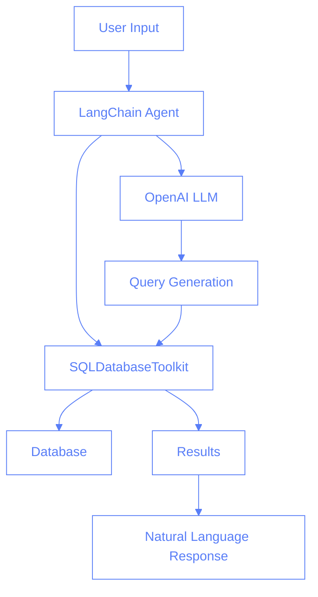
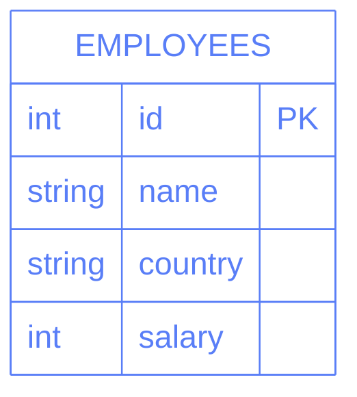
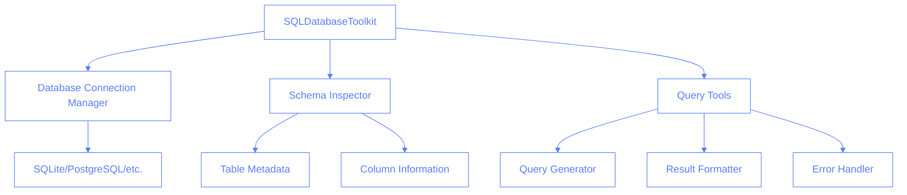

## Flow

```mermaid
%%{init: {'theme': 'base', 'themeVariables': {
'primaryColor': '#ffffff',
'primaryTextColor': '#597ef7',
'primaryBorderColor': '#597ef7',
'lineColor': '#597ef7',
'textColor': '#597ef7',
'mainBkg': 'transparent',
'nodeBorder': '#597ef7',
'clusterBkg': 'transparent',
'labelTextColor': '#597ef7',
'titleColor': '#597ef7',
'clusterBorder': '#fff',
'edgeLabelBackground': 'transparent'
}}}%%

graph TD
    A[User Input] --> B[LangChain Agent]
    B --> C[OpenAI LLM]
    B --> D[SQLDatabaseToolkit]
    D --> E[Database]

    C --> F[Query Generation]
    F --> D
    D --> G[Results]
    G --> H[Natural Language Response]
```

## ERD

```mermaid
%%{init: {'theme': 'base', 'themeVariables': {
'primaryColor': '#ffffff',
'primaryTextColor': '#597ef7',
'primaryBorderColor': '#597ef7',
'lineColor': '#597ef7',
'textColor': '#597ef7',
'textFont': '32px Arial',
'mainBkg': 'transparent',
'nodeBorder': '#597ef7',
'clusterBkg': 'transparent',
'labelTextColor': '#597ef7',
'labelTextSize': '24',
'labelTextWeight': 'bold',
'titleColor': '#597ef7',
'clusterBorder': '#fff',
'edgeLabelBackground': 'transparent',
'fontSize': '24px'
}}}%%

erDiagram
    EMPLOYEES {
        int id PK
        string name
        string country
        int salary
    }
```

## LangChain under the hood

```mermaid
%%{init: {'theme': 'base', 'themeVariables': {
'primaryColor': '#ffffff',
'primaryTextColor': '#597ef7',
'primaryBorderColor': '#597ef7',
'lineColor': '#597ef7',
'textColor': '#597ef7',
'mainBkg': 'transparent',
'nodeBorder': '#597ef7',
'clusterBkg': 'transparent',
'labelTextColor': '#597ef7',
'titleColor': '#597ef7',
'clusterBorder': '#fff',
'edgeLabelBackground': 'transparent'
}}}%%

graph TD
    A[SQLDatabaseToolkit] --> B[Database Connection Manager]
    A --> C[Schema Inspector]
    A --> D[Query Tools]

    B --> E[SQLite/PostgreSQL/etc.]
    C --> F[Table Metadata]
    C --> G[Column Information]
    D --> H[Query Generator]
    D --> I[Result Formatter]
    D --> J[Error Handler]
```

